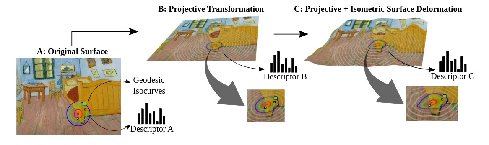

[](https://www.gnu.org/licenses/gpl-3.0)


# GeoPatch Descriptor

This repository contains the original implementation of the descriptor "<b>Learning Geodesic-Aware Local Features from RGB-D Images</b>", published at Computer Vision and Image Understanding journal. GeoPatch is by design invariant to isometric non-rigid deformations of surfaces by leveraging geodesic-invariant sampling, designed as a mapping function before descriptor computation is performed from photometric information.


## <b>Learning Geodesic-Aware Local Features from RGB-D Images</b> <br>[[Project Page]](https://www.verlab.dcc.ufmg.br/descriptors/cviu2022/) [[Paper]](https://arxiv.org/abs/2203.12016)




## Ready to use Docker container

We recommend running the project with Docker, which requires a single command to build the entire project.

First, build the container:

```sh
docker compose build
```

Then, run the docker in interactive mode:

```sh
docker compose run --rm geopatch
```

Finally, you can run the provided demo, which runs both geodesic patch extraction and local feature computation:

```sh
sh run_demo.sh
```

Notice that the output files are being saved inside the container.

## Ready to use Singularity container

Alternatively we also provide a singularity recipe so you can easily and smoothly build the project.

First, build the container:

```sh
sudo singularity build geopatch.sif Singularity.geopatch
```

Then, run the container in interactive mode:

```sh
singularity shell --writable-tmpfs --pwd /src geopatch.sif
```

Finally, you can run the provided demo, which runs both geodesic patch extraction and local feature computation:

```sh
sh run_demo.sh
```

Notice that the output files are being saved inside the container.

## Datasets

All available datasets and ground-truth files are available for download at [https://verlab.dcc.ufmg.br/descriptors](https://verlab.dcc.ufmg.br/descriptors)


## Non-Rigid Simulator

The code for the non-rigid simulator used in our work is available in the [`nonrigid_sim`](nonrigid_sim/) folder. For detailed instructions on usage, please refer to the [`README.md`](nonrigid_sim/README.md) inside the folder.


## Published works

If you find this code useful for your research, please cite the paper:

```
@article{potje2022learning,
  title={Learning geodesic-aware local features from RGB-D images},
  author={Potje, Guilherme and Martins, Renato and Cadar, Felipe and Nascimento, Erickson R},
  journal={Computer Vision and Image Understanding},
  volume={219},
  pages={103409},
  year={2022},
  publisher={Elsevier}
}
```

**VeRLab:** Laboratory of Computer Vison and Robotics https://www.verlab.dcc.ufmg.br
<br>


<br/>
